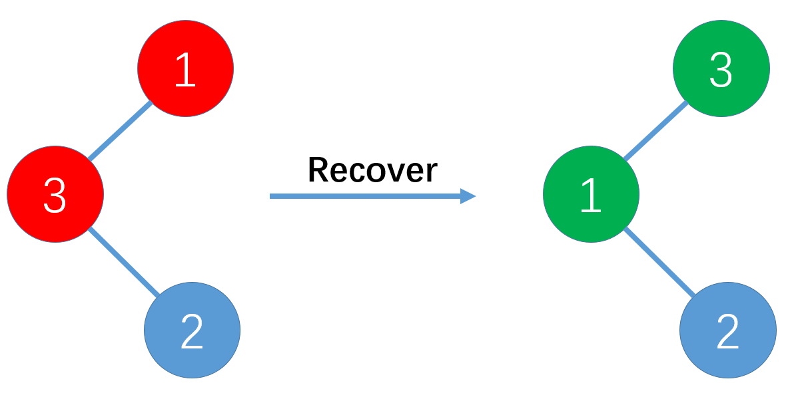

# Experiment 8
## 一.构造二叉树
给定一棵二叉树的前序遍历序列和中序遍历序列，设计程序构造出与序列对应的
二叉树，并输出二叉树的后序遍历序列。
### Input
[4  0  1  3  2  5  7  6  8  10  9] （先序遍历序列）  
[0  1  2  3  4  5  6  7  8  9  10] （中序遍历序列）
### Output
[2  3  1  0  6  9  10  8  7  5  4] （验证树是否构造正确）

## 二.恢复二叉树
一棵二叉搜索树（BST）的某两个节点被交换了，请试图恢复这棵二叉搜索树
二叉搜索树以二叉链表形式存储。

